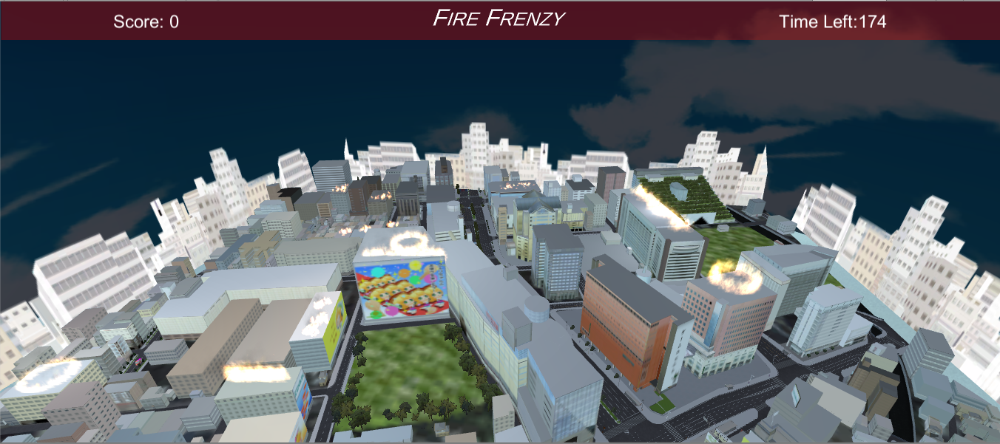
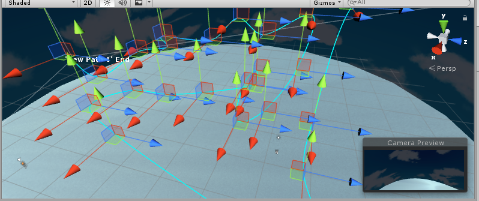

# CS4331002-VR_Project 3

## Team Members
Jordan Coe - Camera Controls, UI Bar, Score + Timer, Player Pathing

Dairen Sokolov - Water Stream, Fire and Water Deletion Scripts

Matthew Jordan - Terrain Creation, City Creation, Fire

## Important Links
 <a href="https://www.youtube.com/watch?v=pOl-wY6o30M">Video Link</a>

<a href="https://unity3d.com/get-unity/download/archive">Unity Download 2017.1.3</a>

### Instructions
Our project requires the downgrade to Unity 2017.1.3 to implement our Fluvio particle system. After having the correct version of Unity running and installing our project, you should be able to run our program. 

After hitting run you will see a starting menu. The starting menu has to buttons. Play, will start the game, and Instructions will show the user the instruction to play the game. After hitting play a text boss will appear to give the user some info of the situation. The goal is to put out the fire in the city by using the waterhose on the helicopter. To fire water, simply hold left-click, and water will be shot out. The user must sustain the water on the fire for a certain amount of time for it to be extinguished. The user will then recieve score for successfully putting out the fire. 

### The City
The city we used is an asset that we got from the asset store (Citation will be at the end of the readme). We thought using a pre-built city would be cut down on time spent since we would need to build a fairly large city, and populate the city with fire, which would be very time consuming if we had to individually put down buildings ourselves. We also added a few firetrucks to simulate the feel of a real city fire. 



### Fire 
We got the fire from another asset, which came with a few prefabs. We then populated the city with fire. We populated the fire around the navigation path that the helicopter would take, since having fire that the user would not be able to reach would waste performance. 

We created a script called DeathByWater which will simulate the fire being put out by the water. This script uses 3 parameters to calculate how the fire is being put out. Endurance is how much water it takes to put out, damage is how much points the water will take away from the fires endurance, and the resistance helps the fire mitagate the damage from water. The code snippet below will show how we calculated the death of the fire particles.

```
void OnParticleCollision(GameObject other) {
    if (other.tag == "Water") {
      endurance -= damage / resistance;
    }
```

```
void Update() {
    if (endurance <= 0 && isAlive) {
      isAlive = false;
      print("Fire is Extinguished");
      foreach(Transform child in this.transform) {
        ParticleSystem particleSystem = child.gameObject.GetComponent<ParticleSystem>();
        if(particleSystem) {
          particleSystem.enableEmission = false;
          particleSystem.Stop();
        } else {
          child.gameObject.SetActive(false);
        }
```

Once the fire is put out the user will gain 100 points towards there score. This is another script related to the fire which will just had 100 points to the score variable if the fire dies.

### Navigation
For making the camera fly on certain paths on its own, we found a simple asset called iTween, which allows the developer to create specified nodes that the camera will follow on a path. At first, iTween limits the developer to 10 nodes, but an easy change to the scripts will allow for an infinite amount of nodes. iTween also allows the developer to change certain aspects of the path, like the speed, how the camera turns, etc. The image below will show how the path looks when you edit it in Unity. You can see the nodes and the blue path that the camera will take.



### Conclusion
Using things that we learned from Project 2, we had an easier time making Project 3 than Project 2. We have become more familiar with Unity as a whole, and we learned cool tricks that we can do using Scripts in Unity. OVerall, this Project was very enjoyable to work on and we are proud of the finished product.

### Assets
<a href="https://assetstore.unity.com/packages/tools/particles-effects/fluvio-free-2888">Fluvio Assets Page</a>

<a href="https://assetstore.unity.com/packages/2d/textures-materials/sky/skybox-series-free-103633">Skybox</a>

<a href="https://assetstore.unity.com/packages/essentials/beta-projects/textmesh-pro-84126">Text Mesh Pro</a>

<a href="https://assetstore.unity.com/packages/vfx/particles/fire-explosions/fire-spell-effects-36825">Fire Assets</a>

<a href="https://assetstore.unity.com/packages/tools/animation/itween-84">iTween</a>

<a href="https://assetstore.unity.com/packages/tools/visual-scripting/itween-visual-editor-180">iTween Visual Editor</a>

<a href="https://assetstore.unity.com/packages/3d/environments/urban/japanese-matsuri-city-35619">Matsuri City Asset</a>

<a href="http://www.seizestudios.com/developer/rpgtalk/">RPGTalk Text Dialog</a>

<a href="https://www.youtube.com/watch?v=-wJSpqrzarE">Music</a>

<a href="http://www.amazingfacts4u.com/fire/">Fire Facts Source 1</a>

<a href="http://discovermagazine.com/2011/oct/20-things-you-didnt-know-about-fire">Fire Facts Source 2</a>

<a href="https://www.firerescue1.com/fire-products/Firefighter-Accountability/articles/1206336-9-facts-about-fire/">Fire Facts Source 3</a>
